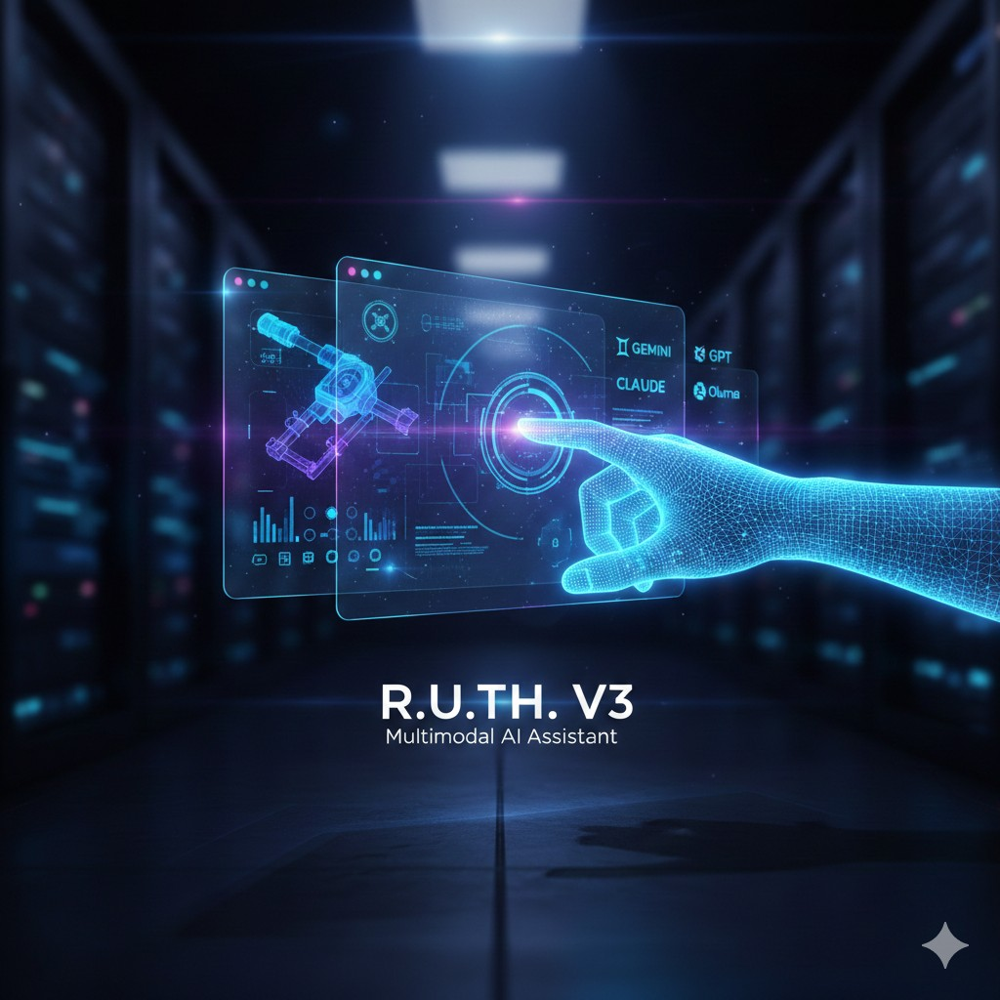
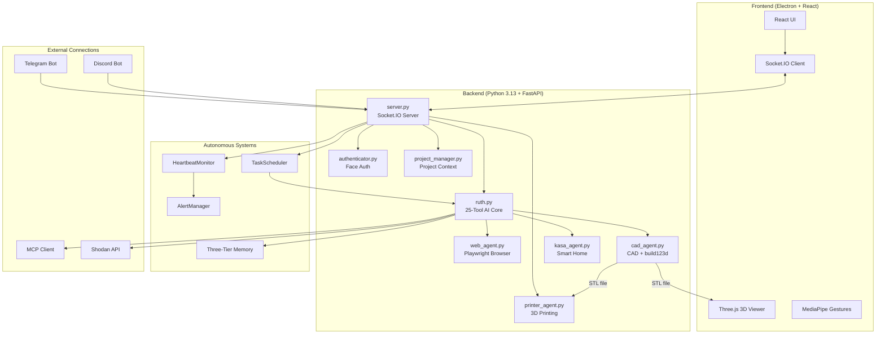

<p align="center">
  
</p>

# R.U.T.H. V3 - Real-time Unified Technology Hub


> **R.U.T.H.** = **R**eal-time **U**nified **T**echnology **H**ub

R.U.T.H. V3 is an autonomous AI assistant designed for Jarvis-level multimodal interaction. It combines multi-model AI support (Gemini, Claude, GPT, Ollama) with real system control, computer vision, gesture control, 3D CAD generation, network security scanning, MCP integration, cross-platform messaging, task scheduling, persistent three-tier memory, and more -- all in an Electron desktop application with 25 built-in tools.

---

## Capabilities at a Glance

| Feature | Description | Technology |
|---------|-------------|------------|
| **Low-Latency Voice** | Real-time conversation with interrupt handling | Gemini 2.5 Native Audio |
| **System Control** | Execute commands, run code, manage the OS | PTY terminal + Python sandbox |
| **Parametric CAD** | Editable 3D model generation from voice prompts | `build123d` + STL |
| **3D Printing** | Slicing and wireless print job submission | OrcaSlicer + Moonraker/OctoPrint |
| **Minority Report UI** | Gesture-controlled window manipulation | MediaPipe Hand Tracking |
| **Face Authentication** | Secure local biometric login | MediaPipe Face Landmarker |
| **Web Agent** | Autonomous browser automation | Playwright + Chromium |
| **Smart Home** | Voice control for TP-Link Kasa devices | `python-kasa` |
| **Security Scanning** | Shodan recon, Nmap scanning, TCP port scanning | `shodan` + `nmap` + asyncio |
| **MCP Integration** | Connect to any MCP-compatible tool server | `mcp` (stdio + HTTP) |
| **Messaging** | Send/receive via Telegram and Discord | `python-telegram-bot` + `discord.py` |
| **Task Scheduling** | Cron jobs, intervals, one-shot tasks | Built-in asyncio scheduler |
| **Heartbeat Monitoring** | Monitor URLs, ports, and processes with alerts | Built-in monitor + alert engine |
| **Three-Tier Memory** | Episodic, semantic, and procedural memory | JSON + vector storage |
| **Document Learning** | Read PDFs, study documents, extract knowledge | `PyPDF2` + memory extractor |
| **Autonomous Planner** | Decompose complex tasks into multi-step plans | Tool chaining engine |

### Gesture Control Details

R.U.T.H.'s "Minority Report" interface uses your webcam to detect hand gestures:

| Gesture | Action |
|---------|--------|
| **Pinch** | Confirm action / click |
| **Open Palm** | Release the window |
| **Close Fist** | "Select" and grab a UI window to drag it |

> **Tip**: Enable the video feed window to see the hand tracking overlay.

---

## Architecture Overview



---

## TL;DR Quick Start (Experienced Developers)

<details>
<summary>Click to expand quick setup commands</summary>

```bash
# 1. Clone and enter
git clone https://github.com/nazirlouis/ruth_v3.git && cd ruth_v3

# 2. Create Python environment (Python 3.11)
conda create -n ruth_v3 python=3.11 -y && conda activate ruth_v3
brew install portaudio  # macOS only (for PyAudio)
pip install -r requirements.txt
playwright install chromium

# 3. Setup frontend
npm install

# 4. Create .env file
echo "GEMINI_API_KEY=your_key_here" > .env

# 5. Run!
conda activate ruth_v3 && npm run dev
```

</details>

---

## Installation Requirements

### Absolute Beginner Setup (Start Here)
If you have never coded before, follow these steps first!

**Step 1: Install Visual Studio Code (The Editor)**
- Download and install [VS Code](https://code.visualstudio.com/). This is where you will write code and run commands.

**Step 2: Install Anaconda (The Manager)**
- Download [Miniconda](https://docs.conda.io/en/latest/miniconda.html) (a lightweight version of Anaconda).
- This tool allows us to create isolated "playgrounds" (environments) for our code so different projects don't break each other.
- **Windows Users**: During install, check "Add Anaconda to my PATH environment variable" (even if it says not recommended, it makes things easier for beginners).

**Step 3: Install Git (The Downloader)**
- **Windows**: Download [Git for Windows](https://git-scm.com/download/win).
- **Mac**: Open the "Terminal" app (Cmd+Space, type Terminal) and type `git`. If not installed, it will ask to install developer tools—say yes.

**Step 4: Get the Code**
1. Open your terminal (or Command Prompt on Windows).
2. Type this command and hit Enter:
   ```bash
   git clone https://github.com/nazirlouis/ruth_v3.git
   ```
3. This creates a folder named `ruth_v3`.

**Step 5: Open in VS Code**
1. Open VS Code.
2. Go to **File > Open Folder**.
3. Select the `ruth_v3` folder you just downloaded.
4. Open the internal terminal: Press `Ctrl + ~` (tilde) or go to **Terminal > New Terminal**.

---

### Technical Prerequisites
Once you have the basics above, continue here.

### 1. System Dependencies

**MacOS:**
```bash
# Audio Input/Output support (PyAudio)
brew install portaudio
```

**Linux (Debian/Ubuntu/Kali):**
```bash
# Audio support + network scanning
sudo apt-get install -y portaudio19-dev nmap
```

**Windows:**
- No additional system dependencies required! (Install nmap from [nmap.org](https://nmap.org/) for network scanning.)

### 2. Python Environment
Create a single Python 3.11 environment:

```bash
conda create -n ruth_v3 python=3.11
conda activate ruth_v3

# Install all dependencies
pip install -r requirements.txt

# Install Playwright browsers
playwright install chromium
```

### 3. Frontend Setup
Requires **Node.js 18+** and **npm**. Download from [nodejs.org](https://nodejs.org/) if not installed.

```bash
# Verify Node is installed
node --version  # Should show v18.x or higher

# Install frontend dependencies
npm install
```

### 4. Face Authentication Setup
To use the secure voice features, R.U.T.H. needs to know what you look like.

1. Take a clear photo of your face (or use an existing one).
2. Rename the file to `reference.jpg`.
3. Drag and drop this file into the `ruth_v3/backend` folder.
4. (Optional) You can toggle this feature on/off in `settings.json` by changing `"face_auth_enabled": true/false`.

---

## Configuration (`settings.json`)

The system creates a `settings.json` file on first run. You can modify this to change behavior:

| Key | Type | Description |
| :--- | :--- | :--- |
| `face_auth_enabled` | `bool` | If `true`, blocks all AI interaction until your face is recognized via the camera. |
| `tool_permissions` | `obj` | Controls manual approval for specific tools. |
| `tool_permissions.generate_cad` | `bool` | If `true`, requires you to click "Confirm" on the UI before generating CAD. |
| `tool_permissions.run_web_agent` | `bool` | If `true`, requires confirmation before opening the browser agent. |
| `tool_permissions.write_file` | `bool` | **Critical**: Requires confirmation before the AI writes code/files to disk. |

---

### 5. 3D Printer Setup
R.U.T.H. V3 can slice STL files and send them directly to your 3D printer.

**Supported Hardware:**
- **Klipper/Moonraker** (Creality K1, Voron, etc.)
- **OctoPrint** instances
- **PrusaLink** (Experimental)

**Step 1: Install Slicer**
R.U.T.H. uses **OrcaSlicer** (recommended) or PrusaSlicer to generate G-code.
1. Download and install [OrcaSlicer](https://github.com/SoftFever/OrcaSlicer).
2. Run it once to ensure profiles are created.
3. R.U.T.H. automatically detects the installation path.

**Step 2: Connect Printer**
1. Ensure your printer and computer are on the **same Wi-Fi network**.
2. Open the **Printer Window** in R.U.T.H. (Cube icon).
3. R.U.T.H. automatically scans for printers using mDNS.
4. **Manual Connection**: If your printer isn't found, use the "Add Printer" button and enter the IP address (e.g., `192.168.1.50`).

---

### 6. API Keys Setup
R.U.T.H. uses several APIs. Only the Gemini key is required; everything else is optional.

1. Copy `.env.example` to `.env` in the project root.
2. Fill in the keys you have:

```
# Required -- voice and intelligence
GEMINI_API_KEY=your_gemini_key_here

# Optional -- security scanning (https://account.shodan.io/)
SHODAN_API_KEY=

# Optional -- Telegram messaging (via @BotFather)
TELEGRAM_BOT_TOKEN=

# Optional -- Discord messaging (https://discord.com/developers)
DISCORD_BOT_TOKEN=
```

**Getting a Gemini key:**
1. Go to [Google AI Studio](https://aistudio.google.com/app/apikey).
2. Sign in with your Google account.
3. Click **"Create API Key"** and paste it into `.env`.

> **Note**: Keep this file private. Never commit your `.env` file to Git.

---

## Running R.U.T.H. V3

You have two options to run the app. Ensure your `ruth_v3` environment is active!

### Option 1: The "Easy" Way (Single Terminal)
The app is smart enough to start the backend for you.
1. Open your terminal in the `ruth_v3` folder.
2. Activate your environment: `conda activate ruth_v3`
3. Run:
   ```bash
   npm run dev
   ```
4. The backend will start automatically in the background.

### Option 2: The "Developer" Way (Two Terminals)
Use this if you want to see the Python logs (recommended for debugging).

**Terminal 1 (Backend):**
```bash
conda activate ruth_v3
python backend/server.py
```

**Terminal 2 (Frontend):**
```bash
# Environment doesn't matter here, but keep it simple
npm run dev
```

---

## First Flight Checklist (Things to Test)

1. **Voice Check**: Say "Hello Ruth". She should respond.
2. **System Control**: Say "What are my system specs?" -- Ruth should use `system_info`.
3. **Terminal Access**: Say "Run uptime on my system" -- Ruth should use `execute_command`.
4. **CAD Check**: Open the CAD window and say "Create a cube". Watch the logs.
5. **Web Check**: Open the Browser window and say "Go to Google".
6. **Memory**: Say "Remember that my favorite color is blue" -- then later ask "What is my favorite color?"
7. **Smart Home**: If you have Kasa devices, say "Turn on the lights".
8. **Security** (optional): If Shodan key is set, say "Search Shodan for Apache servers".

---

## Commands & Tools Reference (25 Tools)

### Voice Commands
- "Switch project to [Name]"
- "Create a new project called [Name]"
- "Turn on the [Room] light"
- "Make the light [Color]"
- "Pause audio" / "Stop audio"

### System Control
- **Terminal**: "Run apt update on my system" / "Check disk space" / "List running services"
- **Code Execution**: "Write a Python script that does X and run it"
- **System Info**: "What are my system specs?" / "How much RAM is free?"

### 3D CAD
- **Prompt**: "Create a 3D model of a hex bolt."
- **Iterate**: "Make the head thinner." (Requires previous context)
- **Files**: Saves to `projects/[ProjectName]/output.stl`.

### Web Agent
- **Prompt**: "Go to Amazon and find a USB-C cable under $10."
- **Search**: "Search Google for the latest security news"
- **Note**: The agent will auto-scroll, click, and type. Do not interfere with the browser window while it runs.

### Security & Network
- **Shodan**: "Search Shodan for exposed Apache servers in the US" / "Look up IP 1.2.3.4 on Shodan"
- **Nmap**: "Scan my local network 192.168.1.0/24 for open ports"
- **Port Scan**: "Quick scan ports 1-1000 on example.com"
- **Requires**: `SHODAN_API_KEY` in `.env` for Shodan; `nmap` installed for Nmap scans

### Scheduling & Monitoring
- **Schedule**: "Remind me to check backups every Friday at 9am" / "Run apt update every day at 3am"
- **Monitor**: "Monitor my server at 192.168.1.100 port 80" / "Watch if nginx is running"
- **Alert**: "Alert me if disk usage exceeds 90 percent"

### MCP (Model Context Protocol)
- **Connect**: "Connect to the SQLite MCP server" / "Connect to the GitHub MCP server"
- **Use**: "List available MCP tools" / "Run the query tool on the SQLite server"

### Messaging
- **Send**: "Send a message to my Telegram saying the backup is complete"
- **Status**: "What messaging platforms are connected?"
- **Requires**: `TELEGRAM_BOT_TOKEN` and/or `DISCORD_BOT_TOKEN` in `.env`

### Memory & Learning
- **Recall**: "What do you remember about the deployment process?"
- **Store**: "Remember that the production server IP is 10.0.0.5"
- **Study**: "Study the PDF at ~/docs/kubernetes-guide.pdf"

### Autonomous Planning
- **Complex Tasks**: "Upgrade my system, verify everything works, and report back"
- R.U.T.H. will decompose the task into steps, execute each one, and adapt if something fails.

### Printing & Slicing
- **Auto-Discovery**: R.U.T.H. automatically finds printers on your network.
- **Slicing**: Click "Slice & Print" on any generated 3D model.
- **Profiles**: R.U.T.H. intelligently selects the correct OrcaSlicer profile based on your printer's name (e.g., "Creality K1").

---

## Troubleshooting FAQ

### Camera not working / Permission denied (Mac)
**Symptoms**: Error about camera access, or video feed shows black.

**Solution**:
1. Go to **System Preferences > Privacy & Security > Camera**.
2. Ensure your terminal app (e.g., Terminal, iTerm, VS Code) has camera access enabled.
3. Restart the app after granting permission.

---

### `GEMINI_API_KEY` not found / Authentication Error
**Symptoms**: Backend crashes on startup with "API key not found".

**Solution**:
1. Make sure your `.env` file is in the root `ruth_v3` folder (not inside `backend/`).
2. Verify the format is exactly: `GEMINI_API_KEY=your_key` (no quotes, no spaces).
3. Restart the backend after editing the file.

---

### WebSocket connection errors (1011)
**Symptoms**: `websockets.exceptions.ConnectionClosedError: 1011 (internal error)`.

**Solution**:
This is a server-side issue from the Gemini API. Simply reconnect by clicking the connect button or saying "Hello Ruth" again. If it persists, check your internet connection or try again later.

---

## What It Looks Like

<p align="center">
  
</p>

---

## Project Structure

```
ruth_v3/
├── assets/                     # Project assets (banner, images)
│   └── ruth-banner.png         # R.U.T.H. banner image
├── backend/                    # Python server & AI logic
│   ├── ruth.py                 # Gemini Live API + 25-tool handler
│   ├── server.py               # FastAPI + Socket.IO server
│   ├── tools.py                # Tool declarations for Gemini
│   ├── config.py               # App configuration & defaults
│   ├── cad_agent.py            # CAD generation orchestrator
│   ├── printer_agent.py        # 3D printer discovery & slicing
│   ├── web_agent.py            # Playwright browser automation
│   ├── kasa_agent.py           # TP-Link smart home control
│   ├── authenticator.py        # MediaPipe face auth logic
│   ├── project_manager.py      # Project context management
│   ├── sandbox.py              # Sandboxed code execution
│   ├── terminal.py             # PTY terminal manager
│   ├── scheduler.py            # Asyncio task scheduler
│   ├── heartbeat.py            # Service heartbeat monitor
│   ├── alerts.py               # Alert rule engine
│   ├── daemon.py               # Background daemon manager
│   ├── mcp_client.py           # MCP client manager
│   ├── memory/                 # Three-tier memory system
│   │   └── manager.py          # Memory manager (episodic/semantic/procedural)
│   ├── messaging/              # Cross-platform messaging
│   │   ├── broker.py           # Message broker & routing
│   │   ├── telegram_adapter.py # Telegram bot adapter
│   │   ├── discord_adapter.py  # Discord bot adapter (discord.py)
│   │   └── base.py             # Adapter base class
│   ├── plugins/                # Plugin system
│   │   ├── registry.py         # Plugin registry
│   │   ├── loader.py           # Auto-loader for plugins
│   │   └── builtin/            # Built-in plugins
│   ├── providers/              # Multi-model AI providers
│   │   ├── gemini.py           # Google Gemini provider
│   │   ├── ollama_provider.py  # Ollama local model provider
│   │   └── router.py           # Model routing logic
│   └── reference.jpg           # Your face photo (add this!)
├── src/                        # React frontend
│   ├── App.jsx                 # Main application component
│   ├── components/             # UI components
│   └── index.css               # Global styles (Tailwind)
├── electron/                   # Electron main process
│   └── main.js                 # Window & IPC setup
├── projects/                   # User project data (auto-created)
├── .env                        # API keys (create this!)
├── .env.example                # Template for required keys
├── requirements.txt            # Python dependencies
├── package.json                # Node.js dependencies
└── README.md                   # You are here!
```

---

## Known Limitations

| Limitation | Details |
|------------|---------|
| **macOS, Windows, Linux** | Tested on macOS 14+, Windows 10/11, and Kali Linux. |
| **Camera Required** | Face auth and gesture control need a working webcam. Disable face auth in `settings.json` if no camera. |
| **Gemini API Quota** | Free tier has rate limits; heavy CAD iteration may hit limits. |
| **Network Dependency** | Requires internet for Gemini API, Shodan, and messaging. Local tools (terminal, code, port scan) work offline. |
| **Single User** | Face auth recognizes one person (the `reference.jpg`). |
| **Security Tools** | Shodan requires an API key. Nmap requires system installation (`sudo apt install nmap`). |
| **Messaging** | Telegram and Discord require bot tokens. Create them via @BotFather / Discord Developer Portal. |

---

## Contributing

Contributions are welcome! Here's how:

1. **Fork** the repository.
2. **Create a branch**: `git checkout -b feature/amazing-feature`
3. **Commit** your changes: `git commit -m 'Add amazing feature'`
4. **Push** to the branch: `git push origin feature/amazing-feature`
5. **Open a Pull Request** with a clear description.

### Development Tips

- Run the backend separately (`python backend/server.py`) to see Python logs.
- Use `npm run dev` without Electron during frontend development (faster reload).
- The `projects/` folder contains user data—don't commit it to Git.

---

## Security Considerations

| Aspect | Implementation |
|--------|----------------|
| **API Keys** | Stored in `.env`, never committed to Git. |
| **Face Data** | Processed locally, never uploaded. |
| **Tool Confirmations** | Write/CAD/Web actions can require user approval via `settings.json`. |
| **Sandboxed Execution** | Code execution runs in isolated sandboxes with resource limits. |
| **No Cloud Storage** | All project data, memory, and configs stay on your machine. |
| **Security Scanning** | Shodan/Nmap tools are for authorized reconnaissance only. R.U.T.H. scans and reports -- she does not auto-exploit. |

> [!WARNING]
> Never share your `.env` file or `reference.jpg`. These contain sensitive credentials and biometric data.

---

## Acknowledgments

- **[Google Gemini](https://deepmind.google/technologies/gemini/)** -- Native Audio API for real-time voice
- **[build123d](https://github.com/gumyr/build123d)** -- Modern parametric CAD library
- **[MediaPipe](https://developers.google.com/mediapipe)** -- Hand tracking, gesture recognition, and face authentication
- **[Playwright](https://playwright.dev/)** -- Reliable browser automation
- **[Shodan](https://www.shodan.io/)** -- Internet-wide device search engine
- **[MCP](https://modelcontextprotocol.io/)** -- Model Context Protocol for tool interoperability
- **[discord.py](https://discordpy.readthedocs.io/)** -- Discord bot framework

---

## License

This project is licensed under the **MIT License** -- see the [LICENSE](LICENSE) file for details.

---

<p align="center">
  <br>
  <strong>Built by Austin -- Core Brim Tech</strong><br>
  <em>Autonomous AI. Real System Control. 25 Tools. One Voice.</em>
</p>
